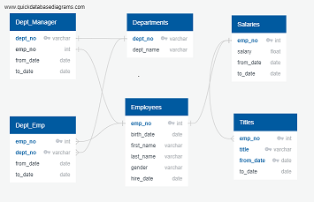
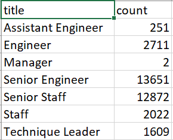

# Pewlett-Hackard-Analysis Report
Create Employee database with Postgres from csv files

## Background and Results
Vanderbilt Data Analysis Bootcamp
Module 7 Challenge
Our goal is to provide for management the total number of employees eligible for retirement, the same information broken down by retirement-eligible employees per title, a list of the retirement-eligible employees and a list of employees eligible to participate in the mentorship program.

### Purpose
Pewlett-Hackerd expects a large portion of employees will be retiring soon.  Management has requested information to determine who is eligilbe for  retirement, how many are eligible, and how many are eligible by their title.  Also needed is a list of current employees who would be eligible to participate in the mentorship program. This information will help management plan for the large number of expected retirements.

### Technical Analysis
Using six csv files provided, build a relational database that contains employee and departmental information from which we can provide reports for management.

Data Sources:

- employees.csv - all current and former employees
- departments.csv - departments in the company
- dept_emp.csv - employee's department history
- dept_manager.csv - list of department's manager history
- salaries.csv -  most recent salary for employees
- titles.csv - employees title history

Software: 

- Postgres database
- PgAdmin editor
- QuickDBD erd builder

### Results

The following ERD (entity relationship diagram) depicts the six main tables created and their relationships to one another.

There are 33,118 current employees eligible for retirement. Alist of these employess can be viewed in the file Data/retiring_employees.csv.
This picture is that total broken down by title:

There are 1,549 current employees eligible to participate in the mentorship program.

## Challenges Encountered and Overcome

To find the total number of retirement-eligble
employees by title, the titles table had to first have it's duplicates removed.  To accomplish this, partition over emp_no was executed to create a new table with only the most current title by emp_no.  This table could then be used to find the current retirement_eligible employees and also the mentorship-eligible employees.

Some departments do not currently have a manager. If departments are not active, consider adding a field to the table to indicate active/inactive.

## Recommendations and Next Steps
Consider reviewing the employees eligible for the mentorship program. It would be helpful if this list showed which employees had matching titles by department to those retiring.  This new report should also include the total retiring by department and title so the department manager can plan more easily.
